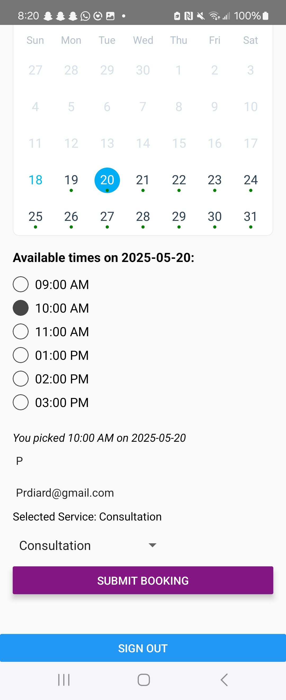

 # May 18 Update: Booking

- booking feature works, information submits to supabase

## Still Needs

- client to see filled timeslot
- client to see and cancel upcoming bookings
- admin to see and cancel bookings

# Old Readme

unzip app-debug.zip
adb install app-debug.apk

# A brief explanation of your data structure and approach

Got supabase authentication working. 

There's a splash page, a user page (with checkboxes and calendar notes), and an admin page that can see all the users checkboxes

## Debugging issue where the checkboxes no longer update supabase

Try some logins:

prdiard@gmail.com (ADMIN)

Pass: 123456

thefloodbringer@gmail.com (USER)

Pass: 123456

thelostfunctions@gmail.com (USER)

Pass: 123456

# User page

# Splash Page

# Admin Page

# Performance notes or enhancements if implemented

Adding notes by Calender day does not work

On the admin page it should be the user's name and email not their UUID

Checkbox Tree does not yet perfectly align with requirements, it needs to support
a Tree Node with no checkbox

The Admin has checkboxes that they cannot set 

The admin cannot see the users' notes

(May 13th: )

Notes is in place

Next step of assignment underway: Booking