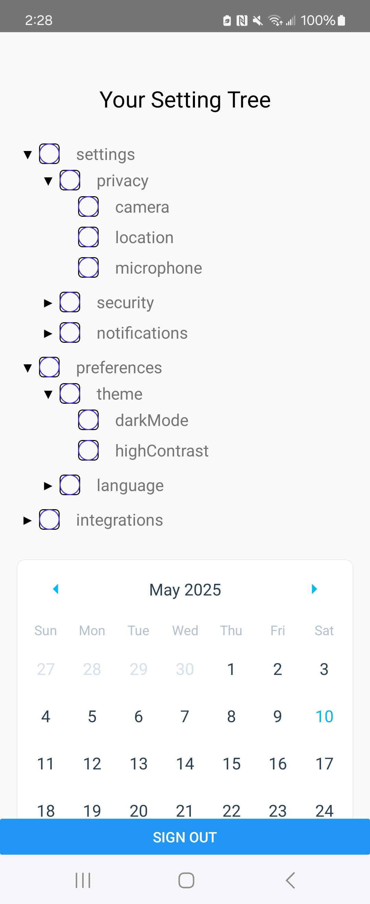
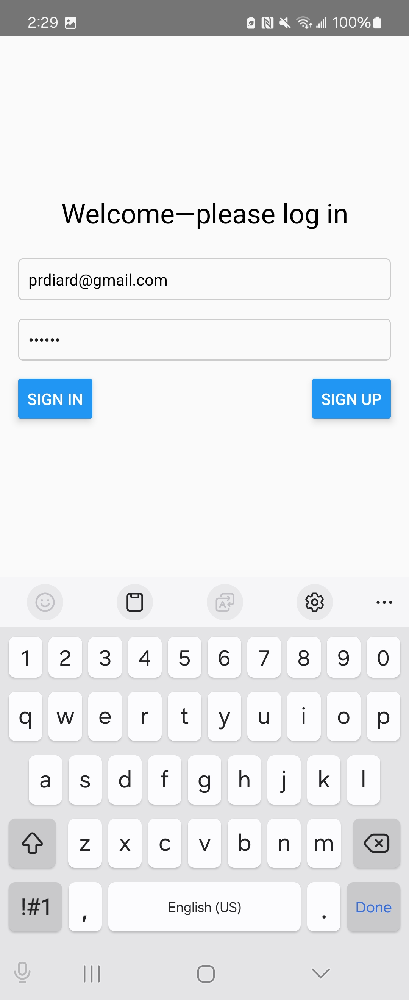
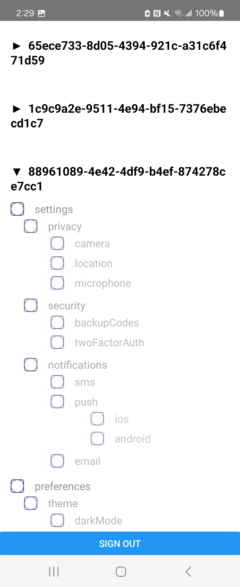

unzip app-debug.zip
adb install app-debug.apk

# A brief explanation of your data structure and approach

Got supabase authentication working. 

There's a splash page, a user page (with checkboxes and calendar notes), and an admin page that can see all the users checkboxes

## Debugging issue where the checkboxes no longer update supabase
# User page

# Splash Page

# Admin Page

# Performance notes or enhancements if implemented

Adding notes by Calender day does not workd